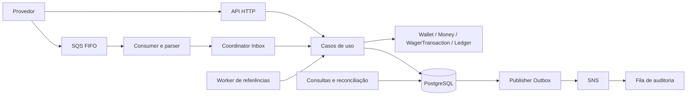

# Distributed Wagering Processor — decisões de arquitetura

## Visão geral

O PostgreSQL é a fonte de verdade financeira. HTTP, SQS e workers reutilizam os
mesmos casos de uso, e as invariantes principais também são protegidas pelo
schema.

Os testes e cenários de concorrência estão documentados em
[docs/TESTING.md](docs/TESTING.md).

## Componentes e responsabilidades

O domínio não importa NestJS ou MikroORM. Classes possuem estado encapsulado,
constructors privados/protegidos, factories e transições explícitas. `Money` e
`WalletLedgerEntry` são imutáveis; datas são copiadas defensivamente. Reidratação
reconstrói estado persistido sem reaplicar operações financeiras.

`ProcessWagerTransactionUseCase`, `ClaimedWagerTransactionProcessor`,
`CreateWalletUseCase` e `PendingReferenceWorker` coordenam regras de domínio por
`WagerProcessingPersistence`. O adapter MikroORM fornece repositories associados
a uma única transação. Cada operação cria seu próprio fork de EntityManager e
Identity Map. Controllers validam contratos `unknown`, delegam e serializam DTOs;
não calculam saldos. As consultas retornam projeções explícitas, sem entidades,
hash do payload ou chave de idempotência.

## Money e persistência exata

Entradas aceitam somente strings canônicas com duas casas: `"25.00"`. Número JSON,
negativo, expoente, NaN, infinito, espaços e escalas diferentes são rejeitados.
O Decimal usa precisão 40; colunas `numeric(20,2)` suportam até
`999999999999999999.99`. O driver mantém os valores como strings e as colunas
financeiras usam `ExactDecimalType`. Esse tipo preserva o mapeamento string do
MikroORM, mas sobrescreve o dirty checking: o `DecimalType` padrão compara por
JavaScript `number` e pode colapsar centavos acima de `Number.MAX_SAFE_INTEGER`;
o tipo exato compara com `decimal.js`. `toFixed(2)` serializa um Decimal já
válido; não arredonda uma entrada inválida para aceitá-la. Não há conversão de
dinheiro para `number`.

O modelo carrega moeda em cada Money. A validação de moeda verifica três letras
maiúsculas; não consulta um catálogo ISO-4217. BRL é o cenário principal e os
conflitos com outras moedas são testados. A aplicação é responsável por aceitar
somente moedas habilitadas caso essa política seja adicionada.

As constraints impõem valores não negativos, moeda estrutural, versões positivas
e aritmética do ledger. A migration `20260906090000` fecha a aceitação de `NaN`
pelo comparador NUMERIC do PostgreSQL nas colunas financeiras restantes.
Infinidades excedem o tipo NUMERIC com precisão limitada. Clientes SQL
privilegiados podem sofrer coerção de escala pelo próprio PostgreSQL; o contrato
de entrada estrito é aplicado antes de persistir pela API e pela fila.

## Abertura de wallet

`CreateWalletUseCase` abre a wallet com versão 1. Saldo inicial positivo persiste,
na mesma transação, wallet, transação interna `OPENING` processada, snapshot de
resultado, um lançamento CREDIT de zero para o saldo inicial e dois eventos:
`WagerTransactionProcessed` e `WalletBalanceChanged`. O saldo inicial já pertence
à criação; não se chama `credit` para aumentar a versão artificialmente.

Saldo zero cria apenas wallet, sem transação ou lançamento financeiro fictício.
`UNIQUE(player_id,currency)` decide a disputa entre criações; a API traduz a
violação específica para 409. Não existe consulta prévia usada como garantia de
unicidade. Qualquer falha antes do commit desfaz todas as escritas.

## Concorrência por wallet

O processamento usa READ COMMITTED e `SELECT ... FOR UPDATE` na wallet. O lock
é mantido até o commit que grava resultado, saldo, ledger e eventos. Outra
operação da mesma wallet observa o saldo confirmado após esperar. Wallets
distintas não compartilham lock financeiro. `version` é uma sequência auditável
de mudanças reais de saldo, não a garantia de exclusão concorrente.

O claim de transação ocorre antes do lock da wallet, por INSERT com
`ON CONFLICT DO NOTHING`. As constraints de chave de idempotência e
`(provider_id,external_transaction_id)` arbitram concorrência entre processos.
A FK transação→wallet é DEFERRABLE e adiada nessa transação. Isso evita que dois
INSERTs mantenham KEY SHARE na mesma wallet e entrem em deadlock ao promover
ambos para FOR UPDATE. A existência da wallet continua sendo verificada no
processamento e a FK continua sendo validada no commit.

Não há mutex global, Redis, cache de idempotência nem lock em memória entre
wallets. `SKIP LOCKED` aparece apenas nos claims de tarefas: referências pendentes
e outbox. As flags `running` evitam sobreposição de ticks dentro de um processo;
o PostgreSQL coordena processos diferentes.

## Idempotência, conflitos e snapshots

O hash SHA-256 cobre uma whitelist dos campos de negócio, com JSON canônico:
provider, external ID, player, wallet, round, game, kind, Money e referência.
Ordenação de propriedades não altera o hash. Metadados de entrega, IDs internos,
timestamp de recepção e chave de idempotência não fazem parte dele.

Uma chave existente com hash igual retorna o resultado persistido. O saldo e a
versão do replay são os observados naquela decisão, mesmo depois de outras
operações na wallet. Hash divergente é conflito. Outra chave com o mesmo
provider/external ID também é conflito. Nenhum replay reaplica Money ou cria
eventos. Snapshots são persistidos também para rejeições e referências pendentes.
Um retry efetivo do worker atualiza o snapshot quando decide o resultado final;
uma chamada de replay não incrementa tentativas.

Estados terminais `PROCESSED`, `REJECTED` e `FAILED` não transitam novamente.
`PENDING` pode terminar ou virar `PENDING_REFERENCE`; este último pode continuar
pendente ou terminar. Falta de wallet/identidade incorreta aborta a tentativa sem
inventar um registro financeiro válido. Legado sem snapshot retorna
`RESULT_UNAVAILABLE`, pois não é seguro fabricar um saldo histórico.

## Operações e referências

BET debita, WIN credita e LOSS registra o resultado sem movimentar saldo.
Valores zero são válidos e não geram ledger ou incremento de versão. REFUND
referencia somente BET processada; ROLLBACK referencia BET, WIN ou REFUND
processada e inverte a direção. As reversões exigem mesmo provider, player,
wallet, moeda e rodada, valor integral e referência diferente da própria
transação. Game ID não é critério de equivalência adicional.

O índice parcial único `(reference_transaction_id,kind)` para reversões
processadas permite no máximo uma reversão de cada tipo. REFUND e ROLLBACK da
mesma BET são tipos distintos; a regra do desafio é unicidade por tipo. Reversão
que debitaria mais que o saldo disponível termina com
`REVERSAL_WOULD_MAKE_BALANCE_NEGATIVE`, distinto de `INSUFFICIENT_FUNDS`.

A referência opcional de WIN é metadado de rastreamento, não uma dependência
financeira. Somente REFUND e ROLLBACK exigem resolução e aguardam referência.
WIN com referência opcional não é uma reversão nem exige igualdade entre o
valor do prêmio e o da aposta.

Referências ausentes ou ainda pendentes são persistidas como
`PENDING_REFERENCE`. O worker agendado reclama linhas vencidas com FOR UPDATE
SKIP LOCKED e usa o mesmo processor e lock de wallet. Tentativas, próxima data e
deadline são persistentes. Defaults: backoff 1 s até 60 s, TTL 24 h, máximo 1440
tentativas. O teto protege contra trabalho indefinido; esgotamento rejeita com
`REFERENCE_NOT_FOUND` e cria evento auditável. Reiniciar não reinicializa o TTL.

## Inbox, SQS e DLQ

Envelope `WagerTransactionRequested` contém `messageId` lógico, tipo,
`occurredAt` ISO e `data`, incluindo `idempotencyKey`. O parser valida estrutura,
campos desconhecidos, Money, referências obrigatórias e exclui OPENING.

Inbox usa PK `(consumer_name,message_id)`. O hash canônico do envelope detecta
reuso do mesmo ID com conteúdo diferente. Inbox, efeito financeiro, snapshot,
ledger e outbox são confirmados na mesma transação. O consumer chama
DeleteMessage somente após essa transação resolver. Uma redelivery encontra a
Inbox processada, confirma sem repetir efeitos e faz ACK com o receipt atual.
IDs de mensagem distintos ainda compartilham a idempotência financeira.

FIFO e MessageGroupId ajudam na entrega, mas não são garantia financeira.
Os testes enviam duplicatas lógicas com deduplication IDs diferentes para não
ter a deduplicação da aplicação escondida pelo broker.

Falha transitória mantém a mensagem e ajusta visibilidade com backoff. Defaults:
5 s até 300 s e 5 tentativas. Mensagem malformada, conflito de envelope ou
esgotamento vai à DLQ; envio à DLQ antecede o DeleteMessage da fila de origem.
Falha nesse envio não remove a origem. Conflitos de negócio por chave/external
ID são ACK-safe somente depois que o coordinator confirma a Inbox terminal.

## Outbox e publicação

Eventos são classes concretas derivadas de `IntegrationEvent`. Envelope contém
eventId, eventType, aggregateId, version, occurredAt, correlationId, causationId
quando aplicável, e data. Cada evento é persistido como JSONB com ID estável.

Publishers reclamam linhas vencidas com FOR UPDATE SKIP LOCKED, publicam no SNS
e gravam `published_at`. O lock da linha de outbox fica aberto durante a chamada
SNS; nunca há publicação dentro da transação financeira original. A chamada
SNS tem prazo de 5 s. Falha grava attempts/backoff, sem teto de descarte. Defaults:
1 s até 60 s. Shutdown termina a publicação em andamento e deixa o restante
para outra instância.

Existe uma janela inevitável entre sucesso no SNS e commit de `published_at`.
Uma morte nessa janela causa republicação. O mesmo eventId e payload são
reutilizados; consumidores externos devem deduplicar por eventId. O sistema
oferece efeitos financeiros únicos e entrega de eventos at-least-once, não
publicação exatamente uma vez. SNS entrega também à fila de auditoria com
RawMessageDelivery para observação local.

| Falha | Estado durável | Recuperação |
|---|---|---|
| Antes do commit financeiro | Nenhuma escrita parcial | Retry com mesma chave/envelope |
| Commit seguido de falha da resposta HTTP | Resultado/saldo/ledger/outbox confirmados | Replay do snapshot |
| Commit antes do ACK SQS | Inbox processada e efeito único | Redelivery deduplicada e ACK |
| Envio à DLQ falha | Mensagem permanece na origem | Retry do envio |
| Morte antes da publicação | Outbox pendente | Outro publisher reclama a linha |
| SNS indisponível | Efeito financeiro confirmado, outbox pendente | Retry com backoff |
| SNS confirmou, published_at não confirmou | Evento pode ter chegado; linha pendente | Republicar mesmo eventId |
| PostgreSQL indisponível | Nenhum novo efeito confirmado | Não ACK financeiro falso; retry |
| Todas as apps reiniciam | Estado em PostgreSQL e mensagens no broker | Workers retomam tarefas persistidas |
| SIGTERM em processamento | Trabalho termina ou visibilidade é devolvida | Nova instância deduplica se necessário |
| Referência nunca chega | Tentativas/deadline persistem | REJECTED/REFERENCE_NOT_FOUND |

## Ledger, consultas e reconciliação

Ledger tem FK composta para transação da mesma wallet, unicidade por
wallet/transação, não negatividade e aritmética. Trigger BEFORE UPDATE OR DELETE
rejeita mutações, incluindo tentativas por SQL direto. Correções financeiras são
novas transações; não se reescreve histórico. Reconciliação não altera dados.

Ledger HTTP usa keyset ascendente `(created_at,id)`, apoiado pelo índice
`(wallet_id,created_at,id)`. Cursor base64url versionado inclui walletId, timestamp
UTC com seis casas e id. Sua forma é opaca para o cliente, validada e não é uma
assinatura/autorização. Limite default 50, máximo 100; lê limit+1 para decidir
nextCursor. Sem OFFSET. Empates são resolvidos pelo id e microssegundos não são
truncados por Date. Inserções concorrentes posteriores podem aparecer em páginas
seguintes; esta API não promete um snapshot entre requests separados.

Reconciliação usa REPEATABLE READ e transação READ ONLY para comparar saldo
materializado com soma SQL exata do ledger no mesmo snapshot. `difference` é
stored minus calculated e pode ser negativo. Inconsistência é diagnóstico,
nunca correção automática. O checker distribuído verifica também continuidade
pelo snapshot de versão das transações, pois IDs aleatórios não representam a
ordem financeira quando timestamps empatam.

## HTTP, observabilidade e autenticação

Entradas inválidas retornam 400; ausentes 404; chaves conflitantes e wallet
duplicada 409; rejeição financeira persistida 422; pendência 202; processamento
e replay processado 200. Wallet criada retorna 201. Falha transitória é 503 com
código estável e sem SQL, credenciais ou stack; falha inesperada é 500. A resposta
de rejeição inclui transactionId, status, failureCode, balance, walletVersion e
idempotentReplay. O cliente repete uma tentativa de resultado incerto com a mesma
chave. Consulte a tabela de endpoints em [TESTING](docs/TESTING.md).

Pino registra IDs de correlação e resultado. Body, autorização, cookies e chave
de idempotência são redigidos nos logs HTTP. Métricas têm labels de baixa
cardinalidade; contadores/histogramas são locais ao processo, gauges consultam
PostgreSQL/SQS. Scrape falho não fabrica backlog zero. `/health/live` verifica
somente o processo; `/health/ready` verifica PostgreSQL e a fila principal.
Dependência indisponível dá 503; mensagens de erro não expõem detalhes internos.
Readiness não é um teste completo de autorização SNS.

Autenticação não foi implementada porque é opcional no escopo do projeto.
`ProviderIdentityGuard` é o ponto de extensão no-op. Uma implantação real
integraria Keycloak ou Zitadel via OIDC, verificaria
assinatura/JWKS, issuer, audience, expiração e mapearia providerId do token para
o payload/path autorizado. A autorização incluiria consultas e reconciliação.
Não haveria tabela própria de senhas. Health permanece aberto; SQS é canal
interno confiável com provider ainda validado no domínio. Antes de uma exposição
pública, seriam necessárias a integração OIDC e a autorização descritas acima.

## Operação e trade-offs

Docker usa Bun 1.4.0, PostgreSQL 18.6 e LocalStack 4.14.0. O build executa o
compilador TypeScript pelo Bun para manter metadados de decorators. O Nest CLI
carrega uma dependência CJS/ESM incompatível com Bun Linux nesta combinação;
compilar diretamente evita depender de outro runtime. Dependências e lockfile
foram preservados. No bootstrap, imports dinâmicos sequenciais carregam
`@nestjs/core`, `nestjs-pino` e `AppModule` nessa ordem, evitando que o Bun
observe o core ESM parcialmente inicializado por uma dependência CommonJS.

`preferTs` segue a extensão do módulo de opções executado: código fonte usa TS;
`dist` usa JS. A capacidade nativa do Bun de executar TypeScript não deve fazer
uma imagem que contém somente `dist` procurar arquivos inexistentes em `src`.
O check offline de runtime confere cinco entidades e sete migrations compiladas.

Compose executa migrations em serviço one-shot antes das apps. Apenas o banco
precisa estar saudável para migrar; apps esperam também a criação das filas,
topic e subscription. Volumes preservam PostgreSQL e LocalStack. O compose
distribuído gera projeto único, rede/volumes próprios e portas aleatórias em
loopback, sem alterar o ambiente normal.

Migrations são versionadas e reversíveis. Down/up é testado em banco descartável;
snapshots locais de schema são desabilitados para que check/dump consultem o
banco real em vez de comparar apenas um arquivo de snapshot anterior. Rollback
de schema em produção depende da política operacional e de backup do ambiente.
O runtime não inclui fixtures de crash; elas ficam em outro target de
imagem. As falhas usam middleware do SDK real e SIGKILL/SIGTERM de containers,
sem endpoint de produção para provocar falhas.

Os limites escolhidos são simplicidade, bloqueio por wallet quente, uma chamada
SNS por transação de outbox, retenção sem arquivamento, suporte estrutural de
moedas e ausência de autenticação implementada. Não há Redis, partidas dobradas,
Kubernetes, CDC, circuit breaker ou benchmark de carga. O workload distribuído
e o checker global cobrem as invariantes financeiras e os cenários de falha
descritos em [docs/TESTING.md](docs/TESTING.md).
